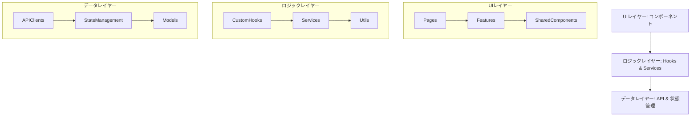
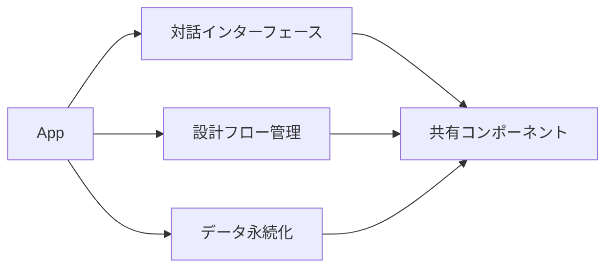
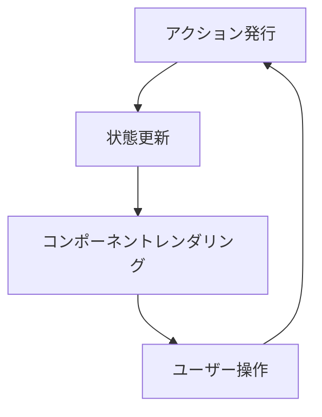
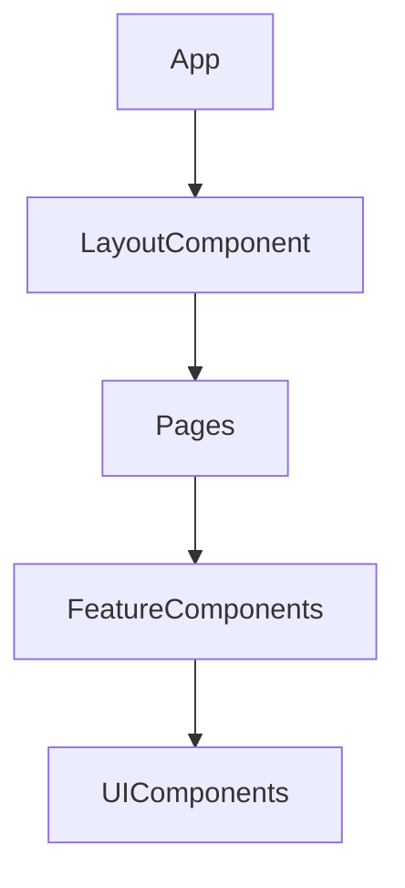
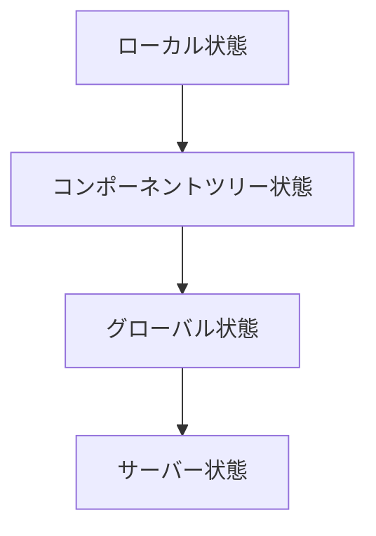

# 設計支援対話アプリ システムパターン

## システムアーキテクチャ

Bulletproof React は、機能モジュール化とクリーンアーキテクチャの原則に基づいた構造を採用します。



## 主要な技術的決定

### 1. 機能ベースのモジュール化

各機能は自己完結した単位として実装し、機能間の依存関係を明示的に管理します。



### 2. コンポーネントの分類

- **UI コンポーネント**: 純粋に表示を担当（Button, Card, Input, ChatBubble）
- **コンテナコンポーネント**: データとロジックを管理（ChatHistory, DesignStepController）
- **ページコンポーネント**: ルートに対応する大きな単位（DesignWorkspace）
- **レイアウトコンポーネント**: ページの構造を定義（MainLayout, SidebarLayout）

### 3. データフロー

単方向データフローとイミュータブルな状態管理を採用します：



### 4. API 通信パターン (データ永続化に API を使用する場合)

- React Query / TanStack Query を使用したデータフェッチング
- エラーハンドリングの集中管理
- ローディング状態の統一管理
- オフライン対応と楽観的 UI 更新の検討

## 使用されるデザインパターン

### 1. カスタムフック

ロジックの再利用と関心の分離を実現します。コンポーネントから状態管理ロジック、副作用、複雑な計算などを抽出し、テストしやすく再利用可能なフックを作成します。

```typescript
// 例: チャットの状態とロジックを管理するカスタムフック
function useChatManager(initialMessages: Message[]) {
  const [messages, setMessages] = useState<Message[]>(initialMessages);
  const [inputValue, setInputValue] = useState("");
  const [isSending, setIsSending] = useState(false);

  const addMessage = useCallback((message: Message) => {
    setMessages((prev) => [...prev, message]);
  }, []);

  const sendMessage = useCallback(
    async (text: string) => {
      if (!text.trim()) return;
      setIsSending(true);
      const userMessage: Message = {
        id: Date.now().toString(),
        sender: "user",
        text,
      };
      addMessage(userMessage);
      setInputValue(""); // 入力フィールドをクリア

      try {
        // ここでAPI呼び出しやボット応答のロジックを実行
        // const botResponse = await getBotResponse(text);
        // addMessage(botResponse);
      } catch (error) {
        console.error("Error sending message:", error);
        // エラーハンドリング
      } finally {
        setIsSending(false);
      }
    },
    [addMessage]
  );

  // ... その他のチャット関連ロジック

  return {
    messages,
    inputValue,
    setInputValue,
    sendMessage,
    isSending,
    // ...
  };
}
```

### 2. Compound Components

関連するコンポーネントをグループ化し、明示的な API を提供します。例えば、タブ UI やアコーディオンなどで使用されます。

```tsx
// 使用例
<Tabs defaultValue="requirements">
  <Tabs.List>
    <Tabs.Trigger value="requirements">要件定義</Tabs.Trigger>
    <Tabs.Trigger value="basic-design">基本設計</Tabs.Trigger>
  </Tabs.List>
  <Tabs.Content value="requirements">要件定義の内容...</Tabs.Content>
  <Tabs.Content value="basic-design">基本設計の内容...</Tabs.Content>
</Tabs>
```

### 3. 高階コンポーネント (HOC)

共通のロジック（例: 認証チェック、ロギング）をコンポーネント間で共有するために使用できますが、カスタムフックの方が推奨される場合が多いです。

```typescript
// 例: ロギング機能を追加するHOC
function withLogging<P extends object>(Component: ComponentType<P>) {
  return function LoggedComponent(props: P) {
    useEffect(() => {
      console.log(
        `Component ${Component.displayName || Component.name} mounted`
      );
      return () => {
        console.log(
          `Component ${Component.displayName || Component.name} unmounted`
        );
      };
    }, []);
    return <Component {...props} />;
  };
}
```

### 4. アダプタパターン (API 利用時)

外部 API から取得したデータをアプリケーション内部で使用するデータモデルに変換する場合に利用します。これにより、API の変更がアプリケーション内部に与える影響を最小限に抑えます。

```typescript
// APIレスポンス型 (例)
interface DesignStepApiResponse {
  step_id: string;
  step_name: string;
  content_data: Record<string, any>;
}

// アプリケーション内部モデル (例)
interface DesignStep {
  id: string;
  name: string;
  content: Record<string, any>;
}

// アダプタ関数
function mapApiDesignStepToModel(apiStep: DesignStepApiResponse): DesignStep {
  return {
    id: apiStep.step_id,
    name: apiStep.step_name,
    content: apiStep.content_data,
  };
}
```

## コンポーネントの関係性

### 1. コンポーネント階層



### 2. 状態共有パターン

状態はできるだけ最小限の範囲で管理し、必要に応じて適切な粒度で共有します。

- **コンポーネント内ローカル状態**: `useState`, `useReducer` (単一コンポーネント内で完結する状態)
- **コンポーネントツリー内共有**: Context API (密接に関連するコンポーネント群での共有)
- **グローバル状態**: Jotai アトム (アプリケーション全体で共有される状態、例: 現在の設計フェーズ、会話履歴)
- **サーバー状態**: TanStack Query (API から取得・更新するデータ、キャッシュ管理が必要な場合)



### 3. コンポーネント通信

- **Props Down**: 親から子へのデータ伝達
- **Events Up**: 子から親への通知（コールバック関数経由）
- **Context**: 深い階層間の共有データ（Props Drilling を避けるため）
- **Global State (Jotai)**: コンポーネントツリーの離れた場所にあるコンポーネント間の状態共有

### 4. テスト駆動コンポーネント設計

各コンポーネントはテスト駆動で設計・開発され、以下の観点でテストされます：

- **単体テスト**: コンポーネントの独立した機能、純粋なロジック
- **統合テスト**: 複数コンポーネントやフック、状態管理の連携
- **ストーリーテスト**: Storybook との連携による UI 確認とドキュメンテーション
- **アクセシビリティテスト**: a11y コンプライアンスの確認

## 拡張性と保守性

本システムは以下の原則に基づき拡張性と保守性を確保します：

1. **機能の明確な境界**: 各機能 (`ChatInterface`, `DesignFlow` など) は独立して開発・テスト可能
2. **型安全性**: TypeScript による厳格な型チェック
3. **テスト駆動**: すべての機能はテストで検証
4. **一貫したコード規約**: ESLint, Prettier による標準化
5. **パフォーマンス最適化**: メモ化、不要な再レンダリングの抑制

## マイグレーション戦略

(既存プロジェクトからの移行ではないため、このセクションは現時点ではあまり関連しませんが、将来的な大規模リファクタリングの参考として残します)
既存のコードから本アーキテクチャへの移行は以下の手順で行います：

1. 共有コンポーネントの抽出と型付け
2. 機能モジュールへの段階的な分割
3. テストの整備
4. 状態管理の統一
5. API クライアント層の抽象化 (API 利用時)

## リスクと軽減策

| リスク                      | 軽減策                                           |
| --------------------------- | ------------------------------------------------ |
| 過剰な抽象化                | コンポーネント/フック設計の定期的な見直し        |
| バンドルサイズの肥大化      | コード分割と遅延ロードの活用、依存関係の精査     |
| 状態管理の複雑化 (Jotai)    | アトムの適切な粒度設計、派生アトムの活用         |
| TypeScript の型定義の複雑さ | 段階的な型システムの導入、ユーティリティ型の活用 |
| 対話フローの複雑化          | 状態マシンやフロー管理ライブラリの検討           |
